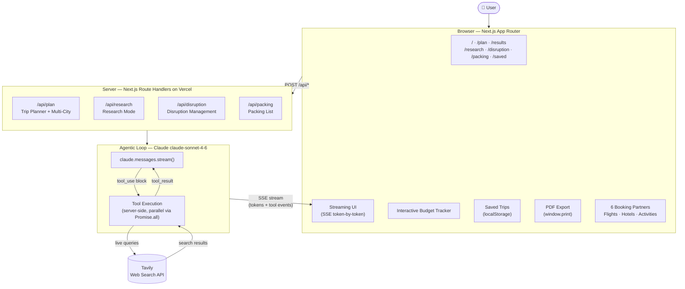

# Travel Companion Agent

An agentic AI travel planner built with Claude, Tavily, and Next.js. Multiple specialized agents run in parallel to search flights, hotels, and activities — then synthesize everything into a structured trip proposal, streamed live to the UI.

**Live demo:** https://travel-agent-ristotto-8650s-projects.vercel.app  
**Stack:** Next.js 16 · Claude API (`claude-sonnet-4-6`) · Tavily Web Search · Tailwind CSS · Vercel

---

## Architecture



---

## Agent Flows

Six specialized agent flows — each with its own tool set and API route:

| Agent | Route | Tools | What it does |
|---|---|---|---|
| **Trip Planner** | `/api/plan` | `search_flights` `search_hotels` `get_activities` `optimize_budget` | Full trip plan from destination, dates, budget, interests |
| **Multi-City Planner** | `/api/plan` | `search_flight_leg` `plan_city_stop` `optimize_total_budget` | A→B→C routing with per-city plans and a consolidated budget |
| **Research Mode** | `/api/research` | `get_visa_requirements` `get_climate_info` `get_safety_info` `get_local_tips` `get_best_time_to_visit` | Pre-booking intelligence: visa, climate, safety, insider tips |
| **Disruption Management** | `/api/disruption` | `check_flight_status` `find_alternative_flights` `get_eu261_rights` `find_airport_facilities` | Flight disruption → status, alternatives, EU261 rights, lounge/hotel options |
| **Packing List** | `/api/packing` | *(direct Claude completion)* | Destination-specific packing checklist based on climate and trip type |
| **Budget Tracker** | *(client-side)* | *(parses AI output)* | Extracts AI cost estimates into an interactive editable breakdown |

---

## Key Technical Decisions

**Parallel tool calls**  
All tools within a single agent turn are called with `Promise.all`. A trip plan that would take ~15s sequentially runs in ~5s. This is a deliberate prompt and schema decision — tools are designed so Claude can call them simultaneously rather than waiting for each result.

**SSE streaming with tool events**  
The API route emits three SSE event types: `tool_call` (a named tool fired — frontend updates the loading step), `token` (a streamed text chunk — frontend renders markdown live), `cards` (structured JSON for the trip card grid). The frontend switches from loading state to result panel on the first `token` event.

**Structured output for trip cards**  
Trip cards are not hardcoded. A `generate_trip_cards` tool with a strict JSON schema forces Claude to return a typed array of destinations (name, tagline, highlights, itinerary, budget breakdown, gradient) — every search produces unique, destination-specific cards.

**No auth, no database**  
Saved trips live in `localStorage`. This keeps the stack minimal and the app fully stateless on the server — the right call for an MVP at this scale.

---

## Feature Overview

| Feature | Status |
|---|---|
| Trip Planner (single destination) | ✅ |
| Multi-City Planner (up to 5 stops) | ✅ |
| Research Mode (visa · climate · safety · local tips) | ✅ |
| Disruption Management (EU261 rights) | ✅ |
| Dynamic Trip Cards (structured output) | ✅ |
| Interactive Budget Tracker (editable line items) | ✅ |
| Packing List Generator | ✅ |
| Saved Trips (localStorage) | ✅ |
| PDF Export | ✅ |
| Booking Deep Links (6 providers) | ✅ |
| Mobile-responsive nav | ✅ |

---

## Project Structure

```
src/
├── app/
│   ├── page.tsx                  # Landing page (with mobile hamburger nav)
│   ├── plan/page.tsx             # 6-step trip form
│   ├── results/page.tsx          # Streaming results, Trip Cards, Budget Tracker
│   ├── research/page.tsx         # Research Mode UI
│   ├── disruption/page.tsx       # Disruption Management UI
│   ├── packing/page.tsx          # Packing List Generator
│   ├── saved/page.tsx            # Saved Trips (localStorage)
│   └── api/
│       ├── plan/route.ts         # Agentic loop: Trip Planner + Multi-City
│       ├── research/route.ts     # Agentic loop: Research Mode
│       ├── disruption/route.ts   # Agentic loop: Disruption Management
│       └── packing/route.ts      # Direct Claude stream: Packing List
├── lib/
│   ├── saved-trips.ts            # localStorage read/write helpers
│   └── utils.ts
└── components/ui/                # shadcn/ui (Button, Card, Dialog, etc.)
```

---

## Run Locally

**Prerequisites:** Node.js 18+, Anthropic API key, Tavily API key

```bash
git clone https://github.com/otttl-sys/travel-agent
cd travel-agent
npm install
```

Create `.env.local`:

```env
ANTHROPIC_API_KEY=sk-ant-...
TAVILY_API_KEY=tvly-...
```

```bash
npm run dev
# → http://localhost:3000
```

---

## What "Agentic" Means in Practice

A standard LLM app takes your question and answers from training data.

This app works differently:

1. You describe a trip to Lisbon in June, budget €2,000
2. Claude receives the request — and instead of answering from memory, it decides: *"I need current flight prices, hotel options, and things to do"*
3. It calls `search_flights`, `search_hotels`, and `get_activities` simultaneously via `Promise.all`
4. Tavily fetches live web results for each query
5. Claude reads those results, calls `optimize_budget` to split the budget across categories
6. Now Claude has real, current data — and writes the trip proposal, streamed token by token

The **agentic loop** is what makes steps 3–6 possible: Claude takes multiple turns, calling tools as needed, before producing the final answer.

---

## Built By

Otto Rist — Partnership & Innovation leader exploring AI-driven distribution and agentic workflows.

[LinkedIn](https://www.linkedin.com/in/ottorist) · [Live Demo](https://travel-agent-ristotto-8650s-projects.vercel.app)
